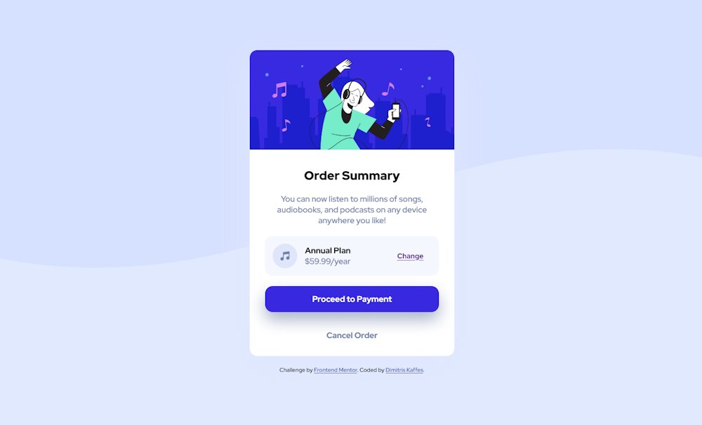

# Frontend Mentor - Order summary card solution

This is a solution from Dimitris Kaffes to the [Order summary card challenge on Frontend Mentor](https://www.frontendmentor.io/challenges/order-summary-component-QlPmajDUj).

## Table of contents

- [Overview](#overview)
  - [The challenge](#the-challenge)
  - [Screenshot](#screenshot)
  - [Links](#links)
- [My process](#my-process)
  - [Built with](#built-with)
  - [What I learned](#what-i-learned)
  - [Continued development](#continued-development)
  - [Useful resources](#useful-resources)
- [Author](#author)
- [Acknowledgments](#acknowledgments)

## Overview

Second frontendmentor challenge.
Some of the `div` elements used in the HTML maybe unnecessary. However, they were used as if this order summary card component was part of a bigger section of a page.
Making the card responsive was achieved by using `max-width`, `min-height`, `rem`, `em` and `%` values. There was no need for a big layout change between desktop and mobile view. The flexbox layout was used to center the card on the `body`. It was also used in the `annual-plan` part of the card.
In order for hover states to work the `link`, `visited`, `hover`, `active` pseudo-classes were added. At this specific order.
A media query was used only for changing the background pattern image on mobile.

### The challenge

Users should be able to:

- See hover states for interactive elements

### Screenshot

### Links

- Solution URL: [order-summary-component solution on Github](https://github.com/dkaffes/order-summary-component)
- Live Site URL: [order-summary-component live site](https://dkaffes.github.io/order-summary-component/)

## My process

Care was given to build a proper HTML structure. The class naming does not follow any special convention. Experimenting with BEM but not following it strictly.
For the buttons, `<a>` elements were used.
The CSS styling was done trying to avoid unnecessary declarations.
The colors part of the `style-guide.md` was a bit misleading so some colors were picked using a color picker on the preview images given in the design folder.

### Built with

- Semantic HTML5 markup
- CSS custom properties
- Flexbox

### What I learned

- The landmark HTML elements and the importance of a solid HTML structure.
- How to properly use in the CSS the pseudo-classes for the different button states.
- Better understanding of flex layout and flex item properties.

### Continued development

- Mobile first design
- Investigate the difference between `<a>` and `<button>` for use as a button link.

### Useful resources

- [HTML structure](https://fedmentor.dev/posts/html-plan-product-preview/) - This helped me understand the principles of a good HTML structure.

## Author

- Frontend Mentor - [@dkaffes](https://www.frontendmentor.io/profile/dkaffes)

## Acknowledgments

Special thanks to [Grace Snow](https://www.frontendmentor.io/profile/grace-snow) for the super useful [Fedmentordev articles](https://fedmentor.dev/)
